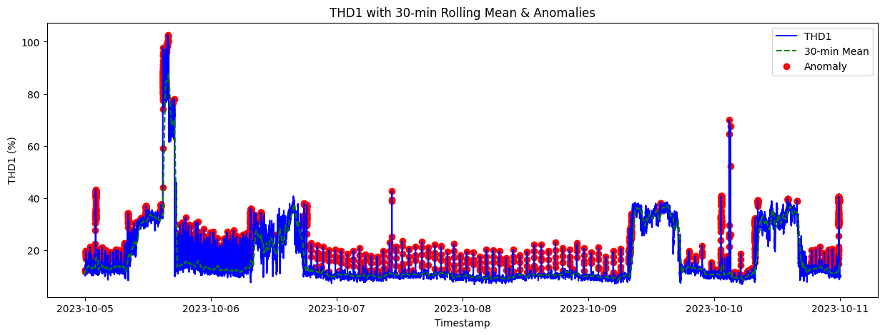

# Grid Power Quality Analysis (THD & Harmonics)

**Analyze real-world three-phase power quality data with a focus on THD and harmonic currents.**  
This project transforms raw panel-level measurements into clean, analysis-ready time series, computes rolling statistics, and provides insight into short-term power quality variations.


**Figure 1:** Mean and anomalies for THD (30 min) for Phase 1

---

## Why This Project

Utility-scale energy systems require continuous monitoring of power quality and harmonic behavior to ensure compliance with grid codes and identify emerging issues early.

This project analyzes real panel-level grid data to explore short-term THD and harmonic behavior using rolling statistics commonly applied in utility and DER monitoring contexts.

---

## Dataset

- **Source:** China Electric Load Monitoring Dataset (CLEMD)
- **Scope:** Panel-level three-phase measurements
- **Sampling:** High-resolution time series
- **Data Type:** Real measured data (no synthetic signals)

> Each file contains multiple panels. Initial analysis focuses on a single panel, but the code is structured to scale to all panels.

---

## Metrics

**Electrical Fundamentals**
- Phase voltages & currents (L1, L2, L3)
- System frequency
- Real power per phase
- Power factor per phase

**Power Quality**
- Total Harmonic Distortion (THD1, THD2, THD3)
- Harmonic currents: H1 (fundamental), H3, H5, H7, H9, H11

**Note:** Higher-order harmonics (H13, H15) and neutral measurements were excluded to reduce noise.

---

## Feature Engineering

- Combine `Date` and `Time` into a single **Timestamp index**
- Sort chronologically
- Drop irrelevant/low-signal columns
- Save cleaned dataset for downstream analysis

> This ensures compatibility with **time-based rolling statistics**.

---

## Rolling Power Quality Metrics

Compute rolling statistics to capture transient and short-term variations:

- **Rolling functions:** mean, max, standard deviation  
- **Time windows:** 5 min, 10 min, 30 min  
- **Applied to:** THD per phase, selected harmonic magnitudes

> Representative of utility and DER monitoring practices.

---

## Repository Structure
```
.
├── data/
│ ├── panels/ # Raw CLEMD panel files
│ └── panel_aggregate.csv # Cleaned, processed dataset
├── src/
│ ├── loader.py # Data loading & feature engineering
│ └── metrics.py # Rolling statistics functions
├── notebooks/
│ └── thd-and-harmonics.ipynb
└── README.md
```
---

## Future Extensions

- Multi-panel comparative analysis
- Automatic harmonic threshold flagging (IEEE-519)
- Event detection (THD spikes, harmonic bursts)
- Panel-to-panel correlation
- Integration with streaming data sources

---

## Requirements

- Python 3.10+
- pandas
- numpy
- matplotlib
